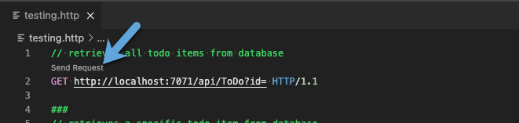
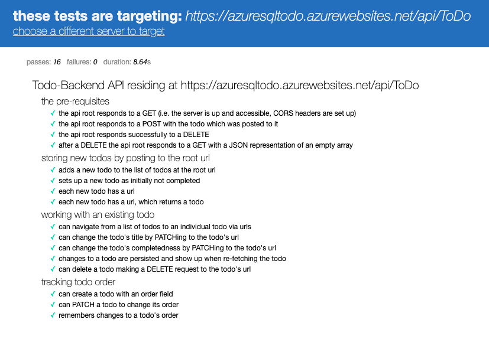

# ToDo Backend Implementation in .NET with Azure SQL bindings for Azure Functions

This project implements the [Todo Backend API](http://www.todobackend.com/index.html) using Azure Functions (.NET) and Azure SQL through HTTP triggers and Azure SQL input/output bindings.

## ToDo Backend

This project implements a ToDo endpoint with the following actions:

* GET all ToDos
* GET a ToDo by Id
* POST a new ToDo
* PATCH an update to a ToDo
* DELETE a ToDo by Id
* DELETE all ToDos

## Getting Started

### Quickstart

1. Configure your development environment for creating Azure Functions with .NET. This [VS Code example](https://docs.microsoft.com/azure/azure-functions/create-first-function-vs-code-csharp?tabs=in-process#configure-your-environment) includes the .NET SDK, Azure Functions Core Tools, and the C# and Azure Functions extensions for VS Code.
2. Clone the repository to your environment
3. Create an [Azure SQL Database](https://docs.microsoft.com/azure/azure-sql/database/single-database-create-quickstart) and execute the script in [/sql/create.sql](/sql/create.sql) to create the table and stored procedure used by this example. Optionally the local development can be done against an local database, such as in a [Docker container](https://docs.microsoft.com/sql/linux/sql-server-linux-docker-container-deployment).

### Application Settings

This example uses 2 application settings to control either secret or deployment-specific information.  During local development, these values are stored in `local.settings.json` at the project root.

* **Connection string to SQL database (General format)** "SqlConnectionString": "Server=tcp:SERVERNAME,PORT;Initial Catalog=DATABASENAME;Persist Security Info=False;User ID=USERNAME;Password=USERPASSWORD;"
* **Primary endpoint URL** "ToDoUri": "http://localhost:7071/api/ToDo"

### Testing
Using the [REST Client](https://marketplace.visualstudio.com/items?itemName=humao.rest-client) extension for VS Code, the [testing.http](testing.http) file provides example requests for the functionality.

## Demo/Validation

The ToDo backend specification has an accompanying runner for tests that validate the functionality.  To run these tests on the demo endpoint, go to [http://todobackend.com/specs/index.html?https://azuresqltodo.azurewebsites.net/api/ToDo](http://todobackend.com/specs/index.html?https://azuresqltodo.azurewebsites.net/api/ToDo).

The functions runtime and SQL database may have gone idle when you test the link, if you find tests fail retry after a few seconds.

## Resources

- [Azure SQL binding for Azure Functions docs](https://docs.microsoft.com/azure/azure-functions/functions-bindings-azure-sql)
- [Azure SQL binding for Azure Functions code and samples](https://github.com/Azure/azure-functions-sql-extension)
